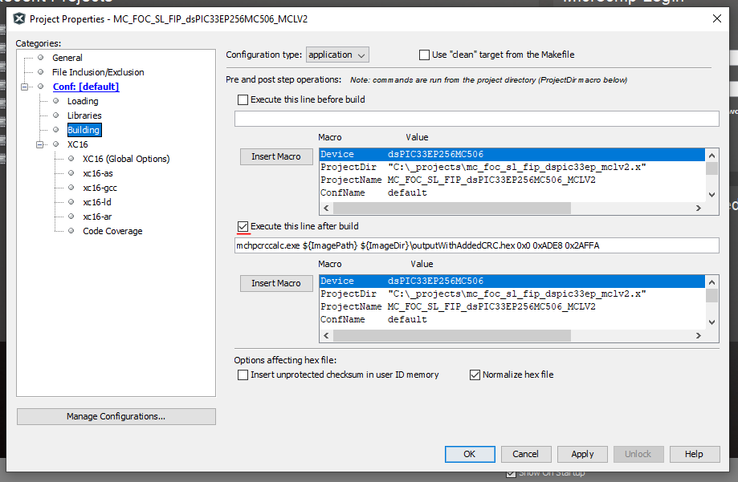

# CRC calculator for [Microchip dsPIC](https://www.microchip.com/en-us/products/microcontrollers-and-microprocessors/16-bit-mcus/dspic33c-dscs-100-mips)

Calculates the CRC checksum for the selected flash area according to Microchip classB library implementation. The script can add the calculated CRC value to the selected address.

ClassB library from Microchip:
https://www.microchip.com/en-us/solutions/consumer/home-appliances/class-b-safety-software

crc configuration: CRCMOD (poly=0x18005, rev=False, initCrc=0xFFFF, xorOut=0x0000).

## Dependencies:

The script using 2 external python module:
crcmod - [http://crcmod.sourceforge.net/](http://crcmod.sourceforge.net/)
intelhex - [https://readthedocs.org/projects/python-intelhex/](https://readthedocs.org/projects/python-intelhex/)


## Usage

 mchpcrccalc.exe [-h] [--verbose] [-v] [INPUT.HEX] [OUTPUT.HEX] [START_ADRESS] [LENGTH] [CRC_STORE_ADDRESS]
| argument | optional | description |
| -------- | -------- | ----------- | 
|  -h, --help | optional | show the help message and exit |
|  --verbose  | optional | increase output verbosity |
|  -v, --version | optional | show program's version number and exit |
|  [INPUT.HEX]  | required | input hex file created by MPLAB X 
|  [OUTPUT.HEX] | required | output hex file with the added CRC value
| [START_ADRESS] | required | CRC will be calculated from this address. (dsPIC program counter address) |
|  [LENGTH] | required | The length address of the tested flash memory in program counter units. |
|  [CRC_STORE_ADDRESS] | required |  CRC will be calculated from this address.|

## Example
mchpcrccalc.py input.hex output.hex 0x0 0xADE8 0x2AFFA

## Use with MPLAb X

You can use this script with MPLAB X. 
1. Download the created executable from the release page. [Releases](releses)
2. Copy the executable to your project root.
3. Set the project properties to run the script at post processing stage: 

```mchpcrccalc.exe ${ImagePath} ${ImageDir}\outputWithAddedCRC.hex 0x0 0xADE8 0x2AFFA```

